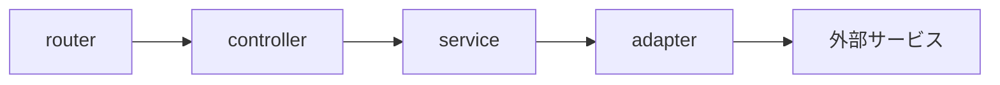

# APIのアーキテクチャ

## 呼び出しの流れ
以下のような層状アーキテクチャを採用

## 層の説明
- router: リクエストを受け取り、controllerに渡す
- controller: リクエストを受け取り、serviceに渡す. swaggerのコメントをここで記入する
- service: ビジネスロジックを実行する.
- adapter: 外部サービスとの通信を行う.DBやAPIなどのとの通信が主
- external service: 外部サービス（DB, APIなど）

## test戦略
`adapter`と `service`に対してテストをかけるようにする。
`make mockgen`で`interface`に従ってmockが生成される。
[tests/mock](../tests/mock)に生成される。
