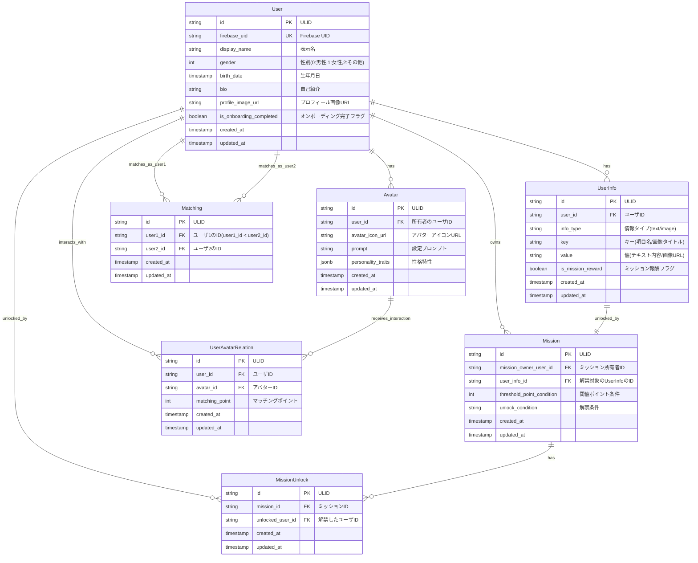

# データ設計

## ER図


## Firestore

### /notifications/${user_id}/notification/{notification_id}
通知情報を格納するコレクション

**パス変数:**
- `user_id`: 通知対象のユーザID (ULID)
- `notification_id`: 通知のID (ULID)

**ドキュメント構造:**
```json
{
  "id": "string (ULID)",
  "user_id": "string (ULID)",
  "title": "string (通知タイトル)",
  "message": "string (通知メッセージ)",
  "created_at": "timestamp"
}
```

### /onboarding_chats/${user_id}/chat/{chat_id}
オンボーディング時のAIキャラクタとの対話ログ

**パス変数:**
- `user_id`: ユーザID (ULID)
- `chat_id`: チャットメッセージのID (ULID)

**ドキュメント構造:**
```json
{
  "id": "string (ULID)",
  "sender_type": "string (user/system/avatar_ai)",
  "message": "string (メッセージ内容)",
  "created_at": "timestamp"
}
```

### /user_avatar_chats/${user_id}/${avatar_id}/{chat_id}
ユーザと異性ユーザのアバターAIとのチャットログ

**パス変数:**
- `user_id`: チャットを行うユーザID (ULID)
- `avatar_id`: 対話相手のアバターID (ULID)
- `chat_id`: チャットメッセージのID (ULID)

**ドキュメント構造:**
```json
{
  "id": "string (ULID)",
  "sender_type": "string (user/system/avatar_ai)",
  "message": "string (メッセージ内容)",
  "avatar": "Avatar (アバター情報のスナップショット)",
  "created_at": "timestamp"
}
```

### /user_chats/${user1_id}/${user2_id}/{chat_id}
マッチング成立後のユーザ同士のチャットログ

**パス変数:**
- `user1_id`: ユーザ1のID (ULID, user1_id < user2_id の制約あり)
- `user2_id`: ユーザ2のID (ULID)
- `chat_id`: チャットメッセージのID (ULID)

**制約:**
- `user1_id < user2_id` となるようにパスを構築すること（ULID辞書順）

**ドキュメント構造:**
```json
{
  "id": "string (ULID)",
  "sender_type": "string (user/system)",
  "message": "string (メッセージ内容)",
  "user1": "User (ユーザ1の情報スナップショット)",
  "user2": "User (ユーザ2の情報スナップショット)",
  "created_at": "timestamp"
}
```
